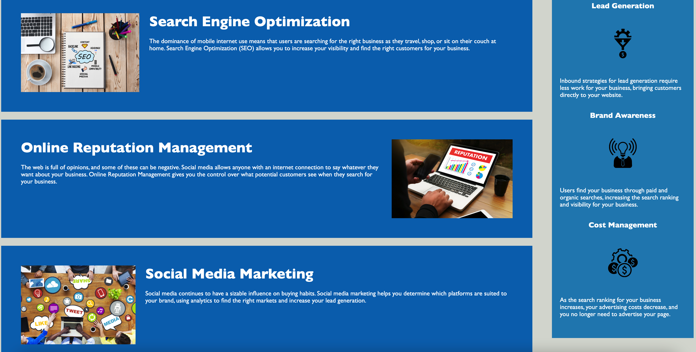

# <Horiseon Website Refactor>

## Description

I was tasked to refactor a marketing webpage for the company Horiseon. I improved the code in the following ways:

 - Updated non-semantic HTML elements with easy to understand semantic elements. 
 - Ensured the HTML elements follow an easy to understand and logical structure.
 - Added alt text for all images to improve SEO and the accessibility user experience.
 - Ensured that all header elements fall in sequential order.
 - Added a descriptive page title to improve SEO and user experience.

## Usage

This implementation can be viewed by following this link: https://nolacoder.github.io/01-Module-Challenge/

To view the html code, right cick anywhere on the screen and choose the Inspect option in a browser with developer tools. From there you can view the structure of the html including the semantic elements. To view the alt text, inspect the image elements and observe their 'alt=' attributes in the dev tools. The updated page title can be viewed by oberving the page or tab title when the webpage is open. 

  

